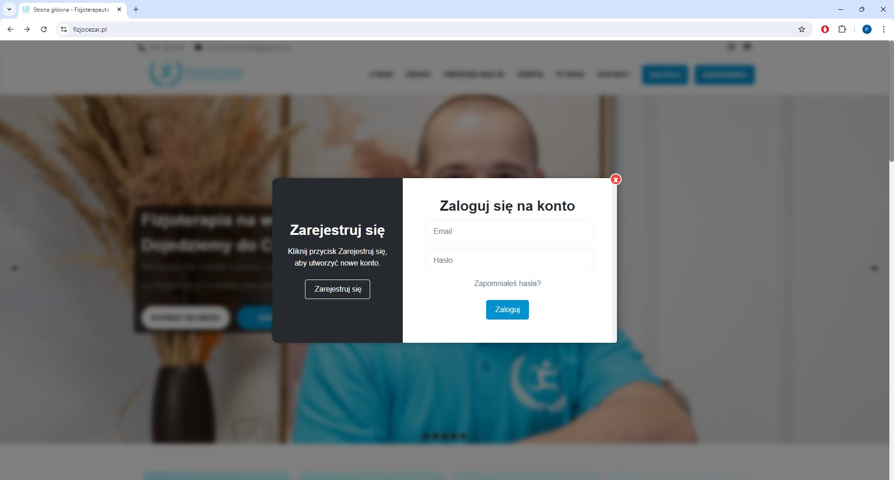
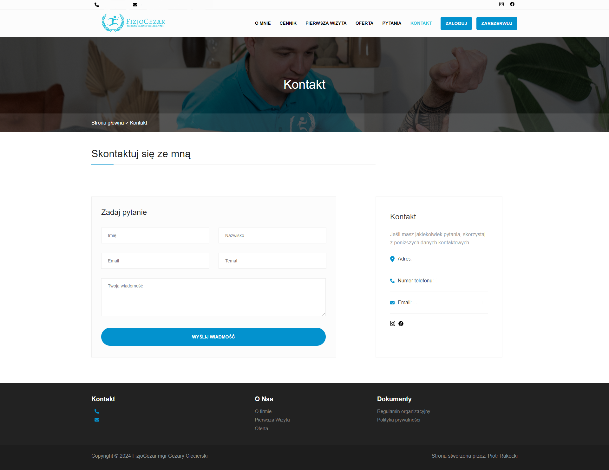
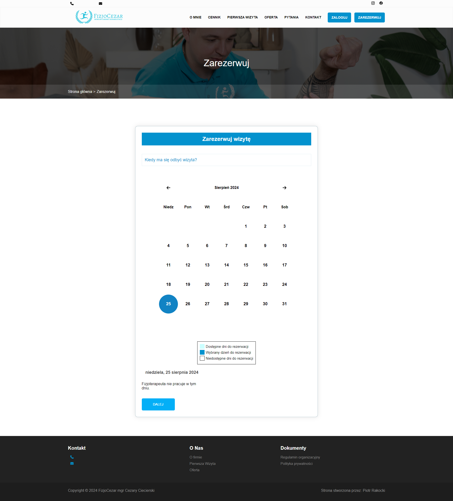
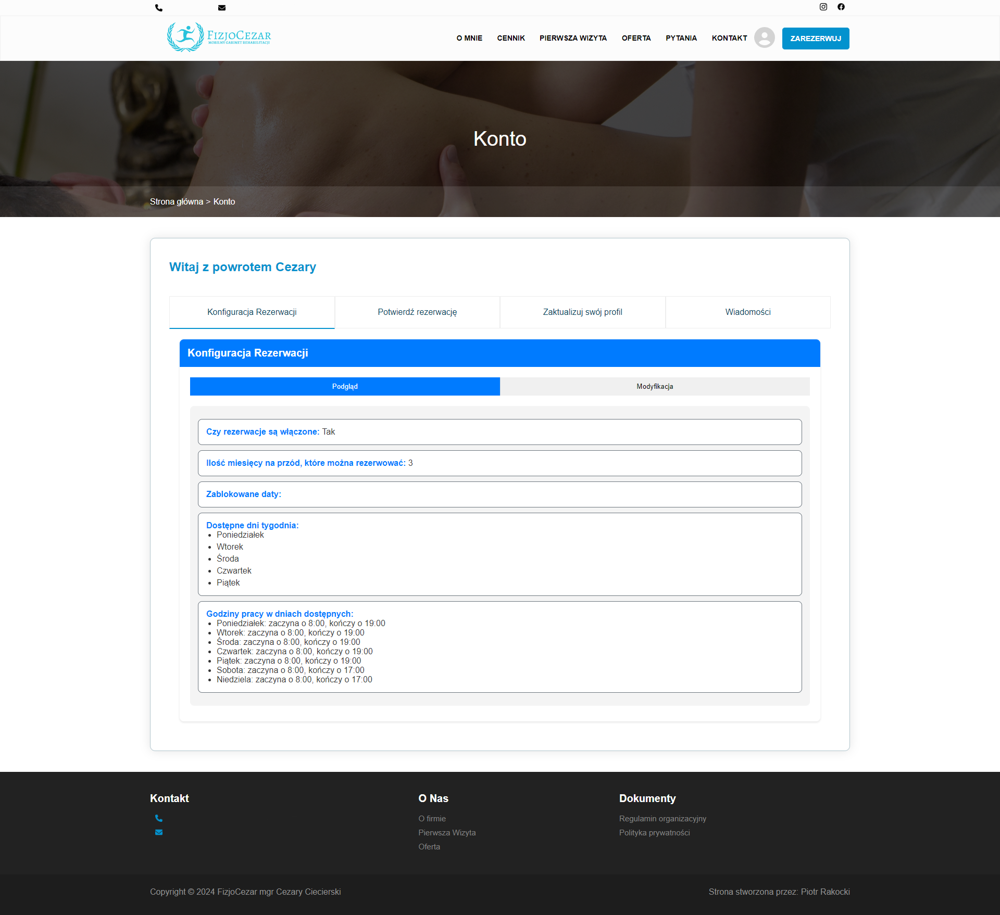

# Physiotherapist Website Project

## Table of Contents
1. [Project Description](#project-description)
2. [My Role](#my-role)
3. [Technologies and Tools](#technologies-and-tools)
4. [Project Features](#project-features)
    - [Login/Registration](#loginregistration)
    - [Ask a Question](#ask-a-question)
    - [Appointment Booking](#appointment-booking)
    - [Appointment Configuration by Admin](#appointment-configuration-by-admin)
    - [Google Calendar Integration](#google-calendar-integration)
5. [Achievements and Results](#achievements-and-results)
6. [Contact Information](#contact-information)

## Project Description
This website is designed for a physiotherapist to streamline the appointment booking process and enhance communication with patients. The project includes a variety of features that allow patients to easily manage their appointments and contact the physiotherapist.

## My Role
I served as the lead developer and system architect, responsible for designing and implementing both the backend and frontend parts of the application.

## Technologies and Tools
- **Backend:** Java 17, Spring Boot 3 (Data JPA, Mail, Security, Devtools), Hibernate, MySQL, Lombok, JWT, Google Calendar API
- **Frontend:** React, Typescript, CSS

## Project Features

### Login/Registration
Users can create accounts by providing necessary information such as name, email, and password. After registration, users can log in using their credentials. The system uses JWT for secure authentication and session management.

*Description:* The login and registration page for users.

### Ask a Question
Patients can submit questions through a dedicated form on the website. These questions are sent directly to the physiotherapist's email and admin panel. This feature allows patients to seek advice or clarify doubts before booking an appointment.

*Description:* The form allowing patients to ask questions.

### Appointment Booking
Patients can book appointments online by selecting a convenient date and time from the available slots. The booking system ensures that there are no double bookings and provides real-time availability updates. Confirmation emails are sent to patients upon successful booking.

*Description:* The appointment booking interface.

### Appointment Configuration by Admin
The administrator can configure available appointment times through a user-friendly interface. This includes setting working hours, blocking specific days, and managing public holidays. The admin can also view and manage all booked appointments.

*Description:* The admin panel for configuring appointment times.

### Google Calendar Integration
Once the physiotherapist confirms an appointment, it is automatically added to their Google Calendar. This integration ensures that the physiotherapist's schedule is always up-to-date and helps in managing appointments more efficiently.

## Achievements and Results
- Enabled patients to easily manage their appointments and directly contact the physiotherapist.
- Automated the appointment booking process, reducing errors and the time needed for schedule management.
- Full synchronization of appointment times with Google Calendar significantly increased the efficiency of the physiotherapist's work.

## Contact Information
For any inquiries or further information, please contact:
- **Name:** Piotr Rakocki
- **Email:** p.rakocki@gmail.com
- **LinkedIn:** www.linkedin.com/in/piotr-rakocki-732316245
- **GitHub:** github.com/piotrrakocki
